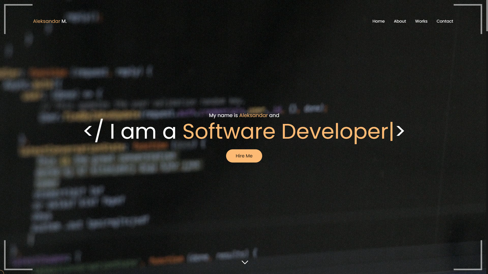
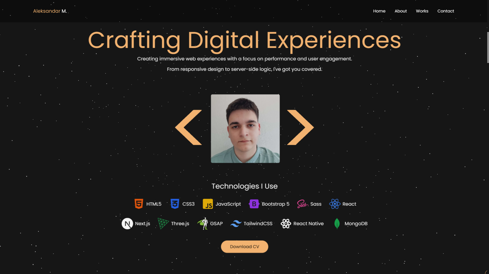
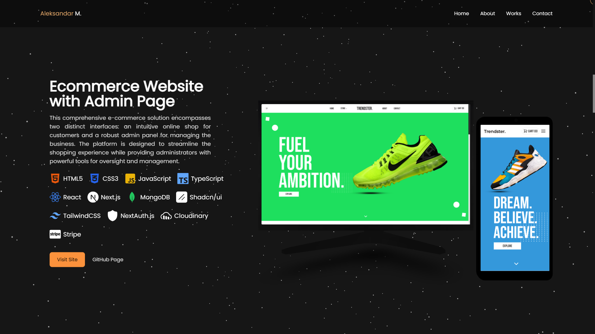
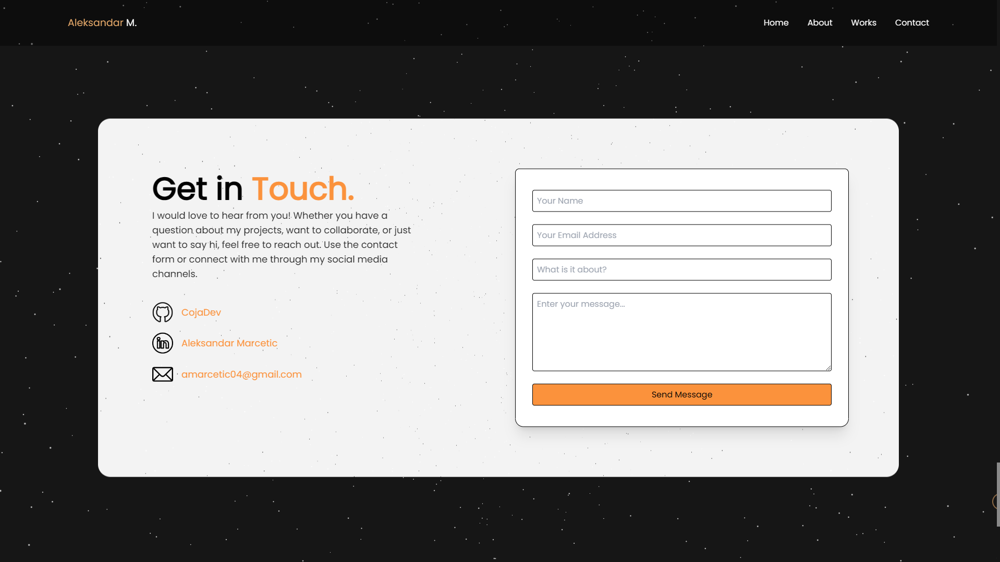

# Portfolio

  
  
  

## Overview

Welcome to my portfolio! This project is a web-based portfolio designed to showcase my skills, projects, and contact information in a visually appealing and interactive way. It includes various sections like Hero, About, Portfolio, Contact, and Footer, with smooth animations and transitions.

## Table of Contents

- [Features](#features)
- [Demo](#demo)
- [Usage](#usage)
- [Customization](#customization)
- [Contributing](#contributing)
- [License](#license)

## Features

- **Hero Section**: A welcoming hero section with a brief introduction and call to action.
- **About Section**: Detailed information about my background, skills, and experience.
- **Portfolio Section**: Showcase of my projects with images, descriptions, and links to live demos or repositories.
- **Contact Section**: Contact form and social media links for easy communication.
- **Footer**: A footer with additional links and copyright information.
- **Responsive Design**: The portfolio is designed to work seamlessly on various screen sizes and devices.
- **Loading Screen**: An engaging loading screen with smooth transitions.

## Demo

You can see a live demo of this portfolio [here](https://portfolio-coja.vercel.app/).

## Usage

Once the project is set up, you can customize the content and styles to match your preferences. The main sections are organized in separate components for easy modification.

## Customization

You can customize the portfolio's appearance and content to suit your preferences:

- **Content**: Update the text and images in the respective components (`Hero`, `About`, `Portfolio`, `Contact`, `Footer`).
- **Styles**: Modify the styles in the `styles` directory to change the look and feel of the portfolio.
- **Animations**: Adjust the animations and transitions to add your personal touch.

## Contributing

Contributions to this project are welcome! If you have ideas for improvements or find bugs, please open an issue or submit a pull request.

## License

This project is licensed under the MIT License - see the [LICENSE](LICENSE) file for details.

---

Thank you for checking out my portfolio. I hope it gives you a good understanding of my skills and experience. If you have any questions or need assistance, feel free to reach out to me.
